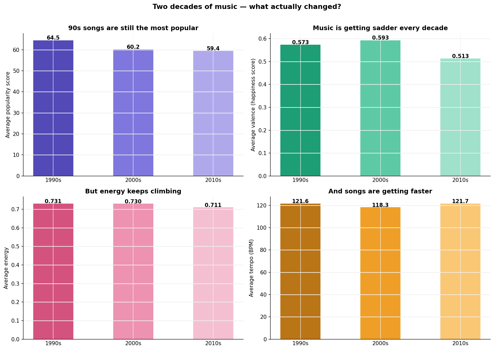

# 🎵 Vibes to Metrics: What Makes a Song Go Viral?
## *Reverse-engineering two decades of chart-toppers with data*



**Author:** Trupthi Raj
**Tools:** Python · pandas · Matplotlib · Seaborn · scikit-learn
**Dataset:** Spotify Top Hits 1998–2020 · 2,000 songs · 18 audio features

---

## Why this exists

There are two types of people in the world: those who have music playing
at all times, and those who are wrong. I am firmly in the first camp.

So when Spotify told me my top genre was "sad indie" for the third year
running, I decided to fight back — with data.

This analysis reverse-engineers two decades of chart-toppers to find out
what audio features actually drive popularity. Is it danceability? Energy?
The mysterious Spotify "valence" score that apparently measures how happy
a song sounds?

2,000 songs. 18 variables. One very strong opinion about the 2010s.

---

## What makes this project different

Most Spotify analyses stop at correlation charts. This one goes further:

- **Custom popularity analysis** — breaking down exactly which audio features
  matter and which ones are just noise
- **Hit Song DNA Predictor** — a machine learning model that tries to predict
  popularity from audio features. The result is more interesting than a
  high accuracy score would have been.
- **Which Era Are You?** — a decade classifier that identifies which era a
  song belongs to based purely on its audio fingerprint. 72.5% accurate.
  The 90s are unmistakable. The 2000s and 2010s are basically the same
  decade. The data has opinions.

---

## The six findings

**1. Audio features don't predict popularity**
After building a Random Forest with 100 decision trees, the R² score
came back at -0.053. The model is worse than guessing the average.
This is not a failure — it is the finding. What makes a song popular
is not in the audio. It never was.

**2. Music is getting sadder and faster**
Valence has been declining since the 90s. Tempo has been climbing.
Something happened around 2012 — the happiness score fell off a cliff
and never fully recovered. The data has no further comment.

**3. The 90s had the most distinct sound of any decade**
The era classifier identifies 90s songs with 98% precision. The 2000s
and 2010s are constantly confused with each other. The 90s knew who
it was. The other two decades were still figuring it out.

**4. Rock is the most popular genre despite having the fewest songs**
162 songs. Highest average popularity. Quality over quantity — every
rock track in this dataset is earning its place. Pop has 936 songs
and is merely fine.

**5. Latin music punches above its weight**
15 songs. Second highest average popularity. The efficiency is unmatched.

**6. Loudness and energy are basically the same thing**
Correlation of 0.65 — the strongest relationship in the entire dataset.
Turn it up and it feels more intense. The music industry has been
saying this for decades. Now there's a number attached to it.

---

## The models

### Hit Song DNA Predictor
- **Algorithm:** Random Forest Regressor (100 trees)
- **R² score:** -0.053
- **What this means:** Audio features cannot predict popularity.
  The most important predictor was loudness at 0.134 importance —
  barely ahead of everything else. No single feature dominates.
  Popularity is determined by factors outside the music itself.

### Which Era Are You? — Decade Classifier
- **Algorithm:** Random Forest Classifier (balanced dataset)
- **Accuracy:** 72.5% (vs 33% random baseline)
- **1990s precision:** 98% — the decade is acoustically unmistakable
- **2000s precision:** 53% — constantly confused with the 2010s
- **What this means:** A song's audio fingerprint can tell you roughly
  when it was made 7 times out of 10. That's not nothing.

---

## Project structure
```
spotify-viral-analysis/
├── 01_spotify_analysis.ipynb    ← Full analysis with commentary
├── Vibes_to_Metrics.html        ← Read without running any code
└── charts/
    ├── chart1_decade_trends.png
    ├── chart2_correlation_heatmap.png
    ├── chart3_genre_bubble.png
    ├── chart4_yearly_trends.png
    ├── chart5_feature_importance.png
    └── chart6_era_classifier.png
```
---

## Tech stack

| Tool | Purpose |
|------|---------|
| Python + pandas | Data loading, cleaning, feature engineering |
| Matplotlib + Seaborn | All 6 charts |
| scikit-learn | Random Forest models for prediction and classification |
| Jupyter Notebook | Analysis environment |

---

## Data source

Spotify Top Hits 2000–2019 — [available on Kaggle](https://www.kaggle.com/datasets/paradisejoy/top-hits-spotify-from-20002019)

2,000 songs with Spotify audio features including danceability, energy,
valence, acousticness, speechiness, instrumentalness, liveness and tempo.

---

## What I learned

The most interesting result in this project is the one that looks like
a failure. An R² of -0.053 on the popularity predictor is not a bad model
— it is evidence that the question "what makes a song popular" cannot be
answered from audio data alone.

Knowing when to say "the data doesn't support this conclusion" is more
valuable than forcing a result. That's what this project taught me.

---

*Find me on [GitHub](https://github.com/trupthiraj)* ✨
